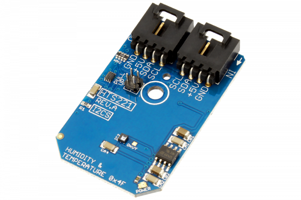

# HTS221

The HTS221, manufactured by STMicroelectronics, is a relative humidity and temperature sensor combined in a single package. It includes a sensing element and a mixed signal ASIC to provide the measurement information through the I2C digital serial interface. The sensing element consists of a polymer dielectric planar capacitor structure capable of detecting relative humidity variations and is manufactured using a dedicated ST process.
This Device is available from www.ncd.io 

[SKU: HTS221_I2CS]

(https://store.ncd.io/product/hts221-capacitive-digital-sensor-for-relative-humidity-and-temperature-i2c-mini-module/)
This Sample code can be used with Arduino.

Hardware needed to interface HTS221 sensor with Arduino

1. <a href="https://store.ncd.io/product/i2c-shield-for-arduino-nano/">Arduino Nano</a>

2. <a href="https://store.ncd.io/product/i2c-shield-for-arduino-micro-with-i2c-expansion-port/">Arduino Micro</a>

3. <a href="https://store.ncd.io/product/i2c-shield-for-arduino-uno/">Arduino uno</a>

4. <a href="https://store.ncd.io/product/dual-i2c-shield-for-arduino-due-with-modular-communications-interface/">Arduino Due</a>

5. <a href="https://store.ncd.io/product/hts221-capacitive-digital-sensor-for-relative-humidity-and-temperature-i2c-mini-module/">HTS221 Capacitive Digital Humidity and Temperature Sensor</a>

6. <a href="https://store.ncd.io/product/i%C2%B2c-cable/">I2C Cable</a>

HTS221:

the HTS221, manufactured by STMicroelectronics, is a relative humidity and temperature sensor combined in a single package. It includes a sensing element and a mixed signal ASIC to provide the measurement information through the I2C digital serial interface. The sensing element consists of a polymer dielectric planar capacitor structure capable of detecting relative humidity variations and is manufactured using a dedicated ST process.

Applications:

• Air conditioning, heating and ventilation

• Air humidifiers

• Refrigerators

• Wearable devices

• Smart home automation

• Industrial automation

• Respiratory equipment

• Asset and goods tracking

How to Use the HTS221 Arduino Library

The HTS221 is very easy to interface as following.

1.Address calling:The following command is used to call the address of HTS221 to start the transmission.

            hts.getAddr_HTS221(HTS221_DEFAULT_ADDRESS);           // 0x5F

2.Temperature measurement:The following command is used to set the data rate for the data transmission.

             hts.setDataRate(HUMTEMP_DATARATE_1HZ);             // Humidity (Hz): 1, Temperature (Hz): 1
             
3.Sensor setup:The following command is used to set up the sensor for Humidity and Temperature measurement.              
             
             hts.setUpSensor();
             
4.Output measurement:The following command is used to measure the Humidity and Temperature.            
             
              hts.Measure_Sensor();
